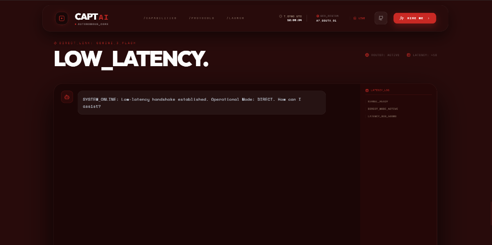
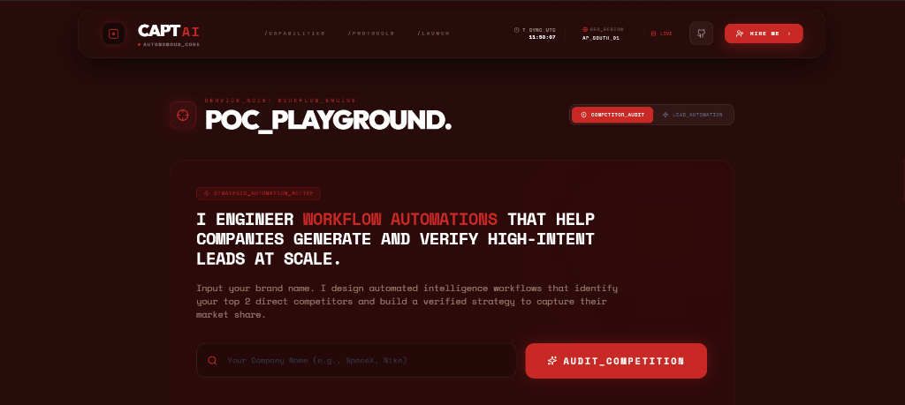

# CAPT AI | Autonomous Command Center 🤖

A cutting-edge AI portfolio showcasing autonomous cognitive architecture and enterprise-grade AI solutions. Built with React, Vite, and powered by Google's Gemini AI.

[](https://vercel.com/new/clone?repository-url=https://github.com/captflag/My-Portfolio)

## 📸 Preview


*Terminal-style hero section with real-time system monitoring*


*AI-powered lead generation and workflow automation*

## ✨ Features

- **🎨 Cyberpunk Design** - Modern, dynamic UI with glassmorphism and micro-animations
- **🤖 AI-Powered Chat** - Interactive consultation using Gemini AI
- **📊 RAG Visualizer** - Real-time demonstration of Retrieval-Augmented Generation
- **🔄 Adaptive Layout** - Dynamic section reordering based on user intent
- **📱 Fully Responsive** - Optimized for all devices
- **⚡ Lightning Fast** - Built with Vite for optimal performance

## 🚀 Quick Start

### Prerequisites
- Node.js 18+ 
- npm or yarn
- Gemini API key ([get one here](https://aistudio.google.com/app/apikey))

### Installation

```bash
# Clone the repository
git clone https://github.com/captflag/My-Portfolio.git

# Navigate to project directory
cd My-Portfolio

# Install dependencies
npm install

# Create environment file
cp .env.example .env.local

# Add your API key to .env.local
# GEMINI_API_KEY=your_api_key_here
```

### Run Locally

```bash
npm run dev
```

Visit `http://localhost:3000` to view the portfolio.

### Build for Production

```bash
npm run build
npm run preview
```

## 🌐 Deploy to Vercel

1. Push your code to GitHub
2. Import project on [Vercel](https://vercel.com)
3. Add `GEMINI_API_KEY` environment variable
4. Deploy! ✨

## 🛠️ Tech Stack

- **Frontend:** React 19, TypeScript
- **Styling:** Tailwind CSS (CDN)
- **Build Tool:** Vite
- **AI Integration:** Google Gemini API
- **Animations:** Framer Motion
- **Icons:** Lucide React
- **Deployment:** Vercel

## 📂 Project Structure

```
├── components/          # React components
│   ├── TerminalHero.tsx
│   ├── SolutionGrid.tsx
│   ├── RAGVisualizer.tsx
│   ├── AgenticContact.tsx
│   └── ...
├── services/           # API services
├── App.tsx            # Main app component
├── index.tsx          # Entry point
├── vercel.json        # Vercel configuration
└── package.json       # Dependencies
```

## 🎯 Key Components

- **Terminal Hero** - Animated command-line interface introduction
- **Solution Grid** - Showcase of AI capabilities and services
- **RAG Visualizer** - Interactive demonstration of RAG architecture
- **Strategic Roadmap** - Project development timeline
- **POC Playground** - Lead generation with AI consultation
- **Living Command Bar** - Intent-based navigation system

## 🔐 Environment Variables

Create a `.env.local` file with:

```bash
GEMINI_API_KEY=your_gemini_api_key
```

## 📝 License

© 2026 CAPT AI Systems. All rights reserved.

## 👨‍💻 Developer

**Divyansh Dewangan**
- Email: divyanshd666@gmail.com
- LinkedIn: [linkedin.com/in/divyansh-dewangan-aa8aa721b](https://www.linkedin.com/in/divyansh-dewangan-aa8aa721b/)
- GitHub: [@captflag](https://github.com/captflag)

---

Built with ❤️ and AI • Powered by Gemini
